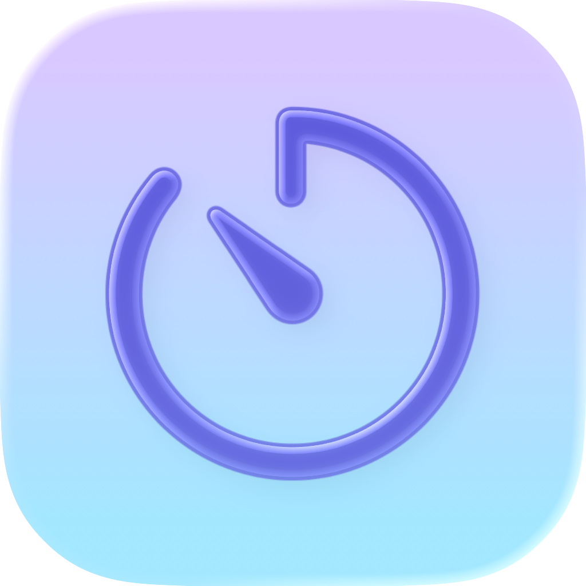
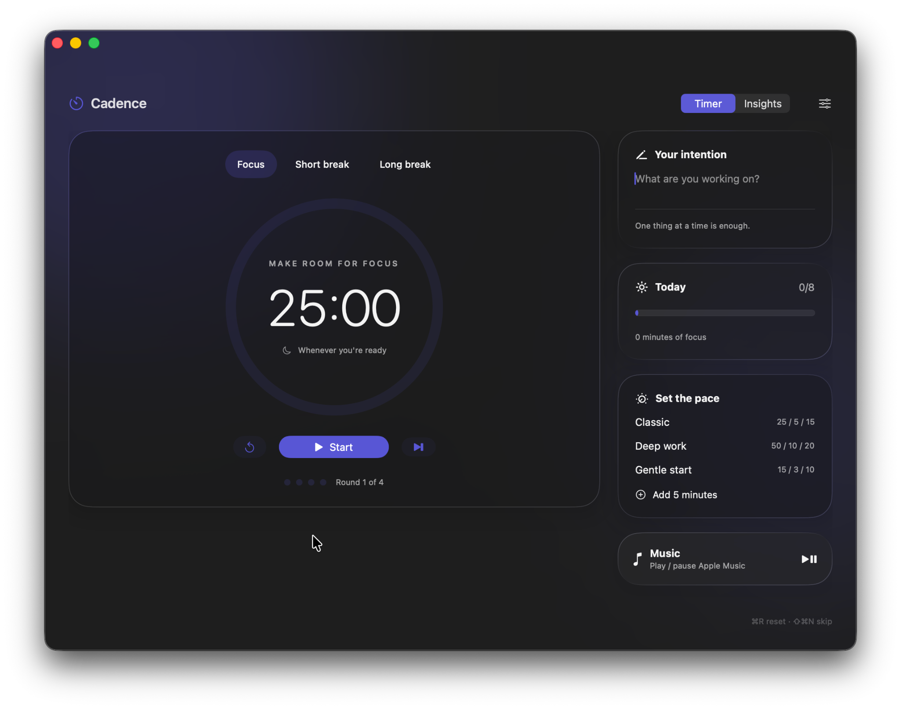

# Cadence



A little structure. A lot of breathing room.

Cadence is a native SwiftUI Pomodoro app for **macOS Sequoia (15) and later**, with native Liquid Glass on **Tahoe (26)** and a translucent material fallback on Sequoia. Built for Apple silicon and Intel Macs. No third-party dependencies, account, telemetry or server.



## Features

- Focus, short break and long break modes with configurable durations and long-break cadence.
- Classic (25/5/15), Deep work (50/10/20) and Gentle start (15/3/10) presets.
- Start, pause, resume, reset, skip and add five minutes. Skips never count as completed focus.
- Optional automatic focus and break starts; intentional defaults start breaks automatically and wait before the next focus.
- Deadline-based timing survives sleep and relaunch. After an overdue interval, records at most one completion and starts at most one fresh interval; it never invents unattended sessions.
- Menu bar countdown and controls; closing the window keeps the app running.
- Task intention, daily goal, seven-day overview, session history and CSV export.
- Apple's installed macOS alert sounds, volume control, preview, repeating alarm and dismissal.
- Scheduled local notifications, optional keep-awake during focus and launch at login.
- Apple Music play/pause through macOS Automation. Opens Music if it is not running. No Spotify integration yet.
- Mac accent colour by default (Cadence purple for Multicolour), plus nine selectable accent colours across timer, background, controls and insights. Existing preferences and history are preserved.
- System/light/dark appearance, reduced-transparency and reduced-motion support, VoiceOver labels, keyboard shortcuts.
- Layered Icon Composer app icon with appearance variants, a compiler-generated Sequoia fallback, and universal `.app` packaging.

## Download and run

Open the latest successful **Build Cadence** run in [Actions](https://github.com/XDanfr/Cadence/actions), download **Cadence-macOS**, extract the artifact and the enclosed ZIP, then move **Cadence.app** to Applications.

Development builds are ad-hoc signed, **not Developer ID signed or notarised**. Gatekeeper may require approval in System Settings → Privacy & Security after attempting to open. Public distribution will need a Developer ID certificate and notarisation.

Open Settings with **⌘,**. **⌘Return** toggles the timer, **⌘R** resets, **⇧⌘N** skips. A reset discards current interval progress. Changing mode also discards current progress. Duration changes apply to the next interval (or reset); presets are available while paused.

Allow notifications in Settings → Alerts. Focus modes may silence banners. The selected alarm plays through the app, using system output volume; notifications do not play a duplicate sound. Cadence must be running for its repeating alarm. When quit, a scheduled banner may still arrive, and reopening reconciles the elapsed interval. Keep-awake only prevents idle system sleep; it does not override lid closure or a manual sleep.

The Music button asks for Automation permission on first use. Controls Music only; there is no access to private Now Playing APIs. Launch-at-login works after installing the packaged app in a stable location. All preferences and history live locally in the app's UserDefaults domain, `me.xdan.Cadence`.

## Build

Requires Xcode 26.3 or later with the macOS 26 SDK to compile Liquid Glass. Rendering the layered Icon Composer assets also requires a Tahoe build host; CI compiles those assets on `macos-26`, then builds and smoke-tests the app on `macos-15`. On a Sequoia build host, download the `Cadence-compiled-assets` artifact from a successful run and set `CADENCE_COMPILED_ASSETS` to its extracted directory when invoking `scripts/build.sh`. The deployment target remains **15.0**; newer APIs are availability-guarded.

```sh
swift test
bash scripts/build.sh
open dist/Cadence.app
```

You can also open `Package.swift` in Xcode. For notifications, automation permissions and login items, run the packaged `.app`, rather than the bare Swift Package executable.

GitHub Actions compiles the layered icon on `macos-26`, runs tests and builds both architectures on `macos-15`, validates the bundle/signature, smoke-tests launch on Sequoia, and uploads a ZIP. No signing secrets are needed for development builds.

## Layout

- `Sources/CadenceCore`: portable timer state and preferences.
- `Sources/Cadence`: SwiftUI app, dashboard, menu panel, insights, settings and macOS services.
- `Tests/CadenceCoreTests`: deadline timing, pause/resume, cycle cadence, skipped sessions, persistence and custom durations.
- `scripts`: universal packaging and icon generation.

## Licence

MIT. Apple system alert sounds are loaded from the user's Mac and are not redistributed.
